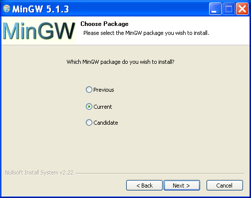
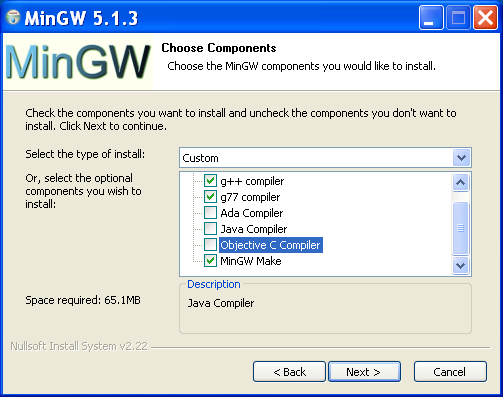
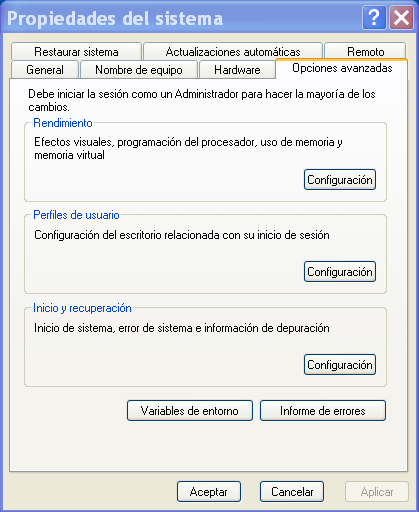
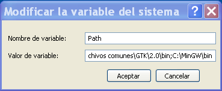
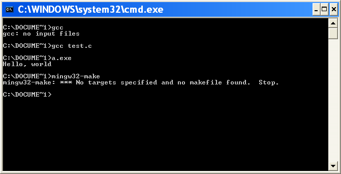
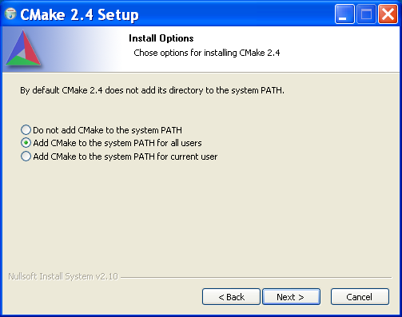
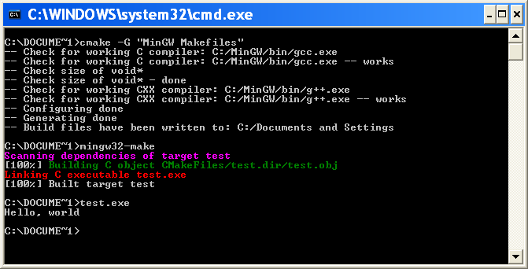

El compilador es una pieza esencial dentro del montaje que propone
este texto.  No hay que perder nunca de vista que se están uniendo
varios lenguajes de programación y, aunque en el fondo todo está
escrito en C, la compatibilidad binaria no esta siempre garantizada.

Se ha escogido el que es, quizás, el compilador más extendido: GCC.
*The GNU compiler collection* o GCC es un ejemplo de portabilidad y
asegura que el código pueda abstraerse del sistema operativo. 

Además, por razones de higiene, sólo en los casos más simples se
utilizará directamente el compilador por línea de comandos. El proceso
de compilación también se abstraerá gracias a cmake, esto permitirá
utilizar cualquier compilador además de GCC.

Cmake es se encarga de la configuración y construcción de las
librerías y los ejecutables.  Fue diseñado para sustituir las
*autotools*, es decir, automake y autoconf.  Está basado en un
sencillo lenguaje de configuración muy intuitivo y con unas pocas
líneas se cubrirán la mayoría de las necesidades.

Instalar GCC y cmake en GNU/Linux
---------------------------------

El compilador de C es parte esencial de cualquier sistema UNIX y linux
no es una excepción. Para evitar posteriores catástrofes puede crearse
un archivo llamado ``test.c`` que contenga lo siguiente::

  #include <stdio.h>
  int main(int argc, char *argv[]){
    printf("Hello, world\n");
  }

A continuación, en una consola y en el mismo directorio::

  U> gcc test.c
  U> a.out
  Hello, world

Cmake es un proyecto relativamente reciente pero ya forma parte de la
mayoría de las distribuciones. La mejor opción será instalarlo
utilizando el propio sistema de paquetes de la distribución.  Una vez
disponible puede construirse el programa anterior mediante un script
de cmake.  Para configurarlo bastará con estas dos líneas::

  project(TEST C)
  add_executable(test test.c)

en un archivo que debe llamarse ``CMakeLists.txt``.  A continación, en
el mismo directorio donde se encuentre el archivo de configuración y
el código del programa::
  
  U> cmake .
  -- Check for working C compiler: /usr/bin/gcc
  -- Check for working C compiler: /usr/bin/gcc -- works
  -- Check size of void*
  -- Check size of void* - done
  -- Configuring done
  -- Generating done
  -- Build files have been written to: /home/guillem
  U> make
  Scanning dependencies of target test
  [100%] Building C object CMakeFiles/test.dir/test.o
  Linking C executable test
  [100%] Built target test
  U> ./a.out
  Hello, world

Este ejemplo sirve para comprender el funcionamiento de cmake.  Lee el
archivo de configuración y crea los makefiles [MAK]_ necesarios para
que make sea capaz de construir el ejecutable.  Cmake dispone de
distintos generadores, cada uno servirá para obtener los datos
necesarios para que, posteriormente, otro programa construya la
librería o el ejecutable.

.. [MAK] http://es.wikipedia.org/wiki/Make

Istalar GCC y cmake en Windows
------------------------------

MinGW significa Minimalistic GNU for Windows, es una colección de
compiladores y librerías capaces de crear ejecutables para Windows
nativos, es decir, que no dependen de ninguna emulación o librería
externa para funcionar. De momento sólo pueden utilizarse en versiones
de windows de 32 bits; el soporte para 64 bits llegará en un futuro no
muy lejano. Además existe la posibilidad de generar programas para
windows en GNU/Linux (cross compiling) y dispone de una versión de
make soportada por cmake.

El instalador puede descargarse de la página del proyecto,
http://www.mingw.org/.  En el primer menú de selección no será
necesario cambiar la opción por defecto (figura 3):

        
  Elección de la versión de los compiladores

El siguiente menú preguntará qué compiladores y herramientas debe
instalar.  Por el momento sólo serán necesarios el compilador de C y
su versión de make pero pueden instalarse tantos como se deseen.

El menú de instalación es el de la figura 4:

  Menú de instalación de los distintos compiladores.

Estos compiladores no incorporan ninguna interfaz gráfica ni IDE, se
usarán únicamente a través de la consola del sistema.  Para acceder a
ellos de forma directa el directorio de instalación debe estar dentro
de la variable PATH de Windows.  Para ello, en windows XP:

.. note::

  Sólo podrán cambiarse las variables de entorno del sistema
  dentro de una cuenta con privilegios de administración.  En
  caso que no pueda accederse a ella la alternativa es crear una
  variable local con el mismo nombre.

1. Abrir el panel de control de Windows.

2. Seleccionar el icono de *Sisitema*

3. Ir a la pestaña de *Opciones avanzadas*.  Dentro está
   el botón que lleva a la lista de variables (figura 5).

  Menú de opciones avanzadas.

4. Finalmente hay que editar la variable Path en el menú siguiente (figura 6).

  Diálogo de edición de la variable de sistema

Todas las consolas que se abran a partir de ahora encontrarán el
compilador de C y make (figura 7).

  Pequeña prueba de gcc y make.

Para realizar el mismo proceso en Windows Vista la mejor opción es
buscar *entorno* en el diálogo de búsqueda del panel de control.

Por desgracia MinGW instalará la versión 3 de los compiladores de
GCC. El compilador de fortran, g77, está considerado obsoleto y no
soporta fortran 90 o 95. Que se produzca el salto también es cuestión
de tiempo. El compilador de fortran más moderno de GCC, gfortran
[GFO]_, debe instalarse a parte de modo análogo a MinGW.

.. [GFO] http://gcc.gnu.org/wiki/GFortran

.. admonition:: TODO

  Saca capturas de cómo instalarlo.

El primer paso para instalar cmake es descargar el instalador de la
página del proyecto [CMK]_.  A diferencia de MinGW el
instalador modificará convenientemente la variable PATH para que la
consola de sistema acceda a los comandos directamente (figura 8)

.. [CMK] http://www.cmake.org/

  Diálogo del instalador de cmake sobre las variables de entorno.

*Finalmente se ha conseguido el objetivo de abstraer todas las
herramientas de configuración y compilación del sistema operativo.  El
proceso será exactamente el mismo, sólo cambiarán algunos comandos.*

Tabla de equivalencias:

================ ==============================
Linux            Windows
================ ==============================
``cmake .``      ``cmake -G "MinGW Makefiles"``
``make``         ``mingw32-make``
================ ==============================

  Construcción del ejemplo en Windows.

