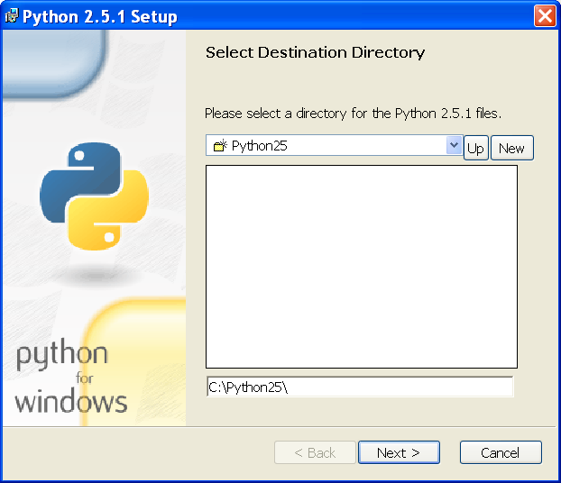
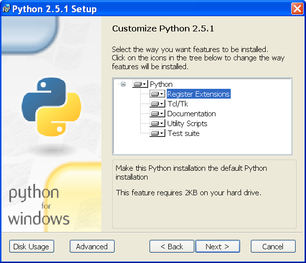

Según su página web Python es un lenguaje dinámico y orientado a
objetos que puede utilizarse para cualquier proyecto de software.
Ofrece potentes herramientas para comunicarse con otros lenguajes de
programación, incluye una gran colección de librerías y puede
aprenderse en sólo unos cuantos días.  Muchos de los desarrolladores
aseguran un aumento en su productividad y mayor facilidad para generar
código de más calidad y de menor coste de mantenimiento gracias a
Python.

En las páginas web de todos los lenguajes de programación aparece un
párrafo parecido.  Es significativo que en la definición como lenguaje
de Python se mencione que proporciona una buena interoperabilidad con
otros lenguajes de programación.  Es sin duda uno de sus puntos
fuertes y es por ello que se ha tomado en consideración para el
desarrollo de aplicaciones híbridas.

Python es además un lenguaje de programación sencillo, potente y
consistente lo que lo hace especialmente adecuado para que los
ejemplos sean fácilmente entendibles y extrapolables a otros lenguajes
de programación.  

La página web del proyecto [PYT]_  es una inestimable
fuente de información.  Incluso los programadores experimentados
pueden encontrar documentación útil a partir de la página.

Si no se conoce Python existen numerosos títulos introductorios como
[TUT]_, [DIV]_ y [THI]_. El más recomendable es el tutorial oficial,
disponible en varios idiomas; es un buen punto de partida.  Se
actualiza junto con el lenguaje de programación para que quien empieza
a dar los primeros pasos no reciba información obsoleta.  Una vez ya
se dispongan de los conocimientos básicos puede darse el salto hacia
la referencia del lenguaje [REF]_.

.. [PYT] http://www.python.org/

.. [TUT] http://www.network-theory.co.uk/python/manual/

.. [DIV] http://diveintopython.org

.. [THI] http://thinkpython.com

.. [REF] http://www.network-theory.co.uk/python/language/

Instalar Python en GNU/Linux
----------------------------

La mayoría de las distribuciones de GNU/Linux utilizan Python para
implementar sus herramientas de gestión.  Esto significa que
probablemente esté ya instalado.  El único trámite es asegurarse que
se dispone de una versión reciente.  Bastará con abrir una consola y
teclear ``python``::

  U> python
  Python 2.4.4 (#1, May 21 2007, 14:49:17)
  [GCC 4.1.1 (Gentoo 4.1.1-r3)] on linux2
  Type "help", "copyright", "credits" or "license" for more information.
  >>>

La versión más actual de Python es la |pythonversion| pero con esta
versión un poco anterior será suficiente. Serán necesarios módulos
adicionales pero su instalación se comentará cuando sea necesario

Instalar Python en Microsoft Windows
------------------------------------

Windows no dispone de un intérprete de Python así que hay que
instalarlo.  Hay varias distribuciones de Python para Windows pero por
sencillez se utilizará la versión oficial.  Puede descargarse de
http://python.org de forma gratuita.  La instalación es sencilla y no
requiere conocimientos adicionales.  Una de las pocas precauciones es
dejar que se instale en el directorio por defecto como muestra la
figura 1.

  Captura de la instalación de Python

Estará bien instalar todos los módulos posibles, Python ocupa bastante
poco en el disco duro.  La figura 2 muestra el aspecto del diálogo con
todos los módulos seleccionados; es la configuración por defecto.

  Captura del menú de módulos a instalar.
